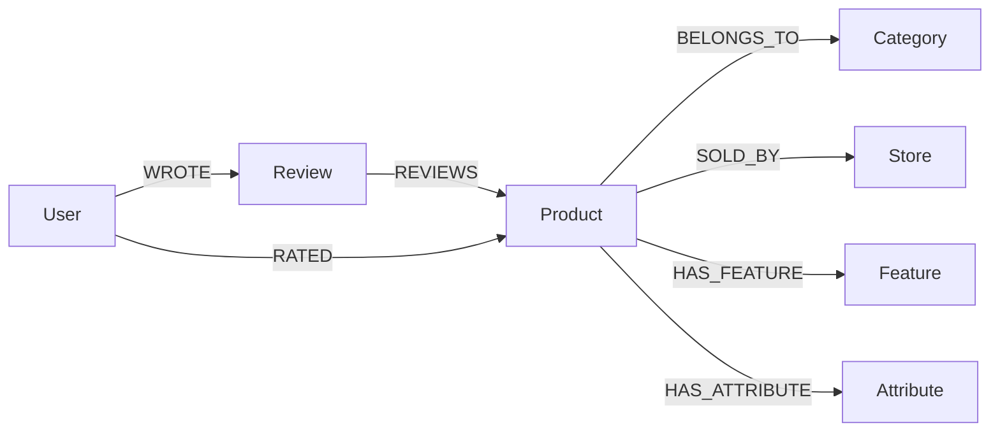

# Knowledge Graph Documentation

This document describes the Amazon Reviews'23 `All_Beauty` knowledge graph used by this repository. It is intended to be maintained as the graph schema, build pipeline, Neo4j import process, and downstream recommendation interfaces evolve.

## Maintenance Status

| Item | Current value |
|---|---|
| Dataset | Amazon Reviews'23 `All_Beauty` |
| Main local data files | `data/All_Beauty.jsonl.gz`, `data/meta_All_Beauty.jsonl.gz` |
| Base graph output | `kg_output/all_beauty/` |
| Aura-size graph output | `kg_output/all_beauty_aura_small/` |
| LLM attribute output | `kg_output/attributes/` |
| Base graph builder | `scripts/build_kg_csv.py` |
| Attribute extractor | `scripts/extract_product_attributes_llm.py` |
| Attribute CSV converter | `scripts/attributes_to_kg_csv.py` |
| Base graph Neo4j importer | `scripts/import_kg_to_neo4j.py` |
| Attribute Neo4j importer | `scripts/import_attributes_to_neo4j.py` |

When the schema or pipeline changes, update this document in the same commit as the code change.

## Purpose

The graph is the main data layer for a knowledge-graph-based product recommendation demo. The current repository focuses on graph construction and orchestration. Recommendation algorithms and frontend work can depend on this graph through stable node labels, relationship types, CSV outputs, and Neo4j query contracts.

The graph should support three recommendation needs:

- Recommend products from a user's historical ratings, purchases, or viewed products.
- Recommend products from explicit user needs, such as "black waterproof eyeliner for daily makeup".
- Return evidence that can explain recommendations, such as shared features, matched attributes, or graph paths.

## Data Sources

The project currently uses two Amazon Reviews'23 files:

| File | Role |
|---|---|
| `data/All_Beauty.jsonl.gz` | Review records, user IDs, ratings, timestamps, review text, and verified purchase flags |
| `data/meta_All_Beauty.jsonl.gz` | Product metadata, titles, categories, store names, features, descriptions, details, prices, and rating summaries |

The key product identifier is `parent_asin`. In this repository it becomes `Product.product_id`.

## Graph Model



## Node Labels

### User

Represents an Amazon review user.

| Property | Source | Notes |
|---|---|---|
| `user_id` | Review `user_id` | Unique ID |

Constraint:

```cypher
CREATE CONSTRAINT user_id IF NOT EXISTS
FOR (u:User) REQUIRE u.user_id IS UNIQUE;
```

### Product

Represents one product, keyed by `parent_asin`.

| Property | Source | Notes |
|---|---|---|
| `product_id` | Metadata/review `parent_asin` | Unique ID |
| `title` | Metadata `title` | Product title |
| `main_category` | Metadata `main_category` | Current data is `All_Beauty` |
| `price` | Metadata `price` | Float or null |
| `average_rating` | Metadata `average_rating` | Float or null |
| `rating_number` | Metadata `rating_number` | Integer or null |

Constraint:

```cypher
CREATE CONSTRAINT product_id IF NOT EXISTS
FOR (p:Product) REQUIRE p.product_id IS UNIQUE;
```

### Review

Represents one review record. The ID is generated deterministically from user, product, timestamp, and row index.

| Property | Source | Notes |
|---|---|---|
| `review_id` | Generated | Unique ID |
| `title` | Review `title` | Review title |
| `text` | Review `text` | Review body |
| `rating` | Review `rating` | Float or null |
| `timestamp` | Review `timestamp` | Integer timestamp |
| `helpful_vote` | Review `helpful_vote` | Integer |
| `verified_purchase` | Review `verified_purchase` | Boolean or null |

Constraint:

```cypher
CREATE CONSTRAINT review_id IF NOT EXISTS
FOR (r:Review) REQUIRE r.review_id IS UNIQUE;
```

### Category

Represents metadata category strings.

| Property | Source | Notes |
|---|---|---|
| `category_id` | Generated from category name | Unique ID |
| `name` | Metadata `main_category` and `categories` | Human-readable label |

### Store

Represents metadata store or brand-like seller names.

| Property | Source | Notes |
|---|---|---|
| `store_id` | Generated from store name | Unique ID |
| `name` | Metadata `store` | Human-readable label |

### Feature

Represents raw product feature or description text from metadata.

| Property | Source | Notes |
|---|---|---|
| `feature_id` | Generated from normalized feature text | Unique ID |
| `text` | Metadata `features` or `description` | Original cleaned text |
| `normalized_text` | Normalized feature text | Lowercased and whitespace-normalized |

Feature nodes are useful for broad evidence paths and baseline recommendations, but they are often longer and less structured than LLM attributes.

### Attribute

Represents structured product attributes extracted by rules and/or LLMs.

| Property | Source | Notes |
|---|---|---|
| `attribute_id` | Generated from `attribute_type`, `name`, and `value` | Unique ID |
| `name` | Extracted attribute name | Example: `brand`, `skin_type`, `size` |
| `value` | Normalized attribute value | Example: `black`, `acne prone`, `yes to` |
| `attribute_type` | Controlled type | Example: `brand`, `color`, `ingredient` |

Current attribute types:

```text
benefit, skin_type, scent, texture, ingredient, material, color, size,
target_area, usage, brand, product_type, other
```

## Relationship Types

| Relationship | Pattern | Properties | Source |
|---|---|---|---|
| `WROTE` | `(User)-[:WROTE]->(Review)` | None | Review data |
| `REVIEWS` | `(Review)-[:REVIEWS]->(Product)` | None | Review `parent_asin` |
| `RATED` | `(User)-[:RATED]->(Product)` | `rating`, `timestamp`, `verified_purchase` | Review data |
| `BELONGS_TO` | `(Product)-[:BELONGS_TO]->(Category)` | None | Metadata categories |
| `SOLD_BY` | `(Product)-[:SOLD_BY]->(Store)` | None | Metadata store |
| `HAS_FEATURE` | `(Product)-[:HAS_FEATURE]->(Feature)` | None | Metadata features/descriptions |
| `HAS_ATTRIBUTE` | `(Product)-[:HAS_ATTRIBUTE]->(Attribute)` | `confidence`, `evidence`, `model` | Rule/LLM attribute extraction |

## Feature vs Attribute

`Feature` and `Attribute` are intentionally separate.

| Type | Example | Strength | Limitation |
|---|---|---|---|
| `Feature` | `Visibly regulates sebum and minimizes pores.` | Preserves original product evidence | Noisy and less normalized |
| `Attribute` | `skin_type = acne prone` | Structured and useful for filtering/recommendation | Depends on extraction quality |

Recommendation algorithms can use both:

- Use `Feature` for broad text evidence and item-item similarity.
- Use `Attribute` for precise user constraints, filtering, and explanation.

## CSV Outputs

### Base Graph CSV

Default output:

```text
kg_output/all_beauty/
```

Aura-size output:

```text
kg_output/all_beauty_aura_small/
```

Base files:

| File | Meaning |
|---|---|
| `nodes_users.csv` | `User` nodes |
| `nodes_products.csv` | `Product` nodes |
| `nodes_reviews.csv` | `Review` nodes |
| `nodes_categories.csv` | `Category` nodes |
| `nodes_stores.csv` | `Store` nodes |
| `nodes_features.csv` | `Feature` nodes |
| `rel_wrote.csv` | `WROTE` relationships |
| `rel_reviews.csv` | `REVIEWS` relationships |
| `rel_rated.csv` | `RATED` relationships |
| `rel_product_category.csv` | `BELONGS_TO` relationships |
| `rel_product_store.csv` | `SOLD_BY` relationships |
| `rel_product_feature.csv` | `HAS_FEATURE` relationships |
| `build_summary.json` | Build counts |

### Attribute CSV

Attribute files are usually written into the same graph output directory:

| File | Meaning |
|---|---|
| `nodes_attributes.csv` | `Attribute` nodes |
| `rel_product_attribute.csv` | `HAS_ATTRIBUTE` relationships |

## Current Known Output Sizes

The following counts come from local generated output summaries and should be refreshed when CSVs are regenerated.

### `kg_output/all_beauty/`

| Item | Count |
|---|---:|
| products | 112,590 |
| users | 168,659 |
| reviews | 200,000 |
| stores | 30,361 |
| categories | 2 |
| features | 89,666 |
| rel_wrote | 200,000 |
| rel_reviews | 200,000 |
| rel_rated | 200,000 |
| rel_product_store | 101,259 |
| rel_product_category | 112,590 |
| rel_product_feature | 110,807 |

### `kg_output/all_beauty_aura_small/`

| Item | Count |
|---|---:|
| products | 33,433 |
| users | 22,896 |
| reviews | 30,000 |
| stores | 9,824 |
| categories | 2 |
| features | 17,897 |
| rel_wrote | 30,000 |
| rel_reviews | 30,000 |
| rel_rated | 30,000 |
| rel_product_store | 18,014 |
| rel_product_category | 20,000 |
| rel_product_feature | 19,344 |

The current Aura-size attribute CSV contains about 2,291 unique attributes and 4,184 product-attribute relationships. Refresh this value with:

```bash
wc -l kg_output/all_beauty_aura_small/nodes_attributes.csv \
      kg_output/all_beauty_aura_small/rel_product_attribute.csv
```

## Build Pipeline

### 1. Build Base KG CSV

```bash
conda activate py312

python scripts/build_kg_csv.py \
  --review-path data/All_Beauty.jsonl.gz \
  --meta-path data/meta_All_Beauty.jsonl.gz \
  --output-dir kg_output/all_beauty
```

Small Aura-friendly graph:

```bash
python scripts/build_kg_csv.py \
  --max-reviews 30000 \
  --max-meta 20000 \
  --max-features-per-product 10 \
  --output-dir kg_output/all_beauty_aura_small
```

### 2. Extract Product Attributes

```bash
python scripts/extract_product_attributes_llm.py \
  --provider deepseek \
  --limit 1000 \
  --resume \
  --compact-input \
  --skip-sparse \
  --batch-size 5 \
  --workers 3
```

The extractor reads credentials and model settings from `.env`.

### 3. Convert Attributes to CSV

```bash
python scripts/attributes_to_kg_csv.py \
  --input-path kg_output/attributes/product_attributes_llm.jsonl \
  --output-dir kg_output/all_beauty_aura_small
```

### 4. Import Base Graph into Neo4j or Aura

```bash
python scripts/import_kg_to_neo4j.py \
  --input-dir kg_output/all_beauty_aura_small
```

### 5. Import Attributes

```bash
python scripts/import_attributes_to_neo4j.py \
  --input-dir kg_output/all_beauty_aura_small
```

## Common Neo4j Queries

### Count Nodes by Label

```cypher
MATCH (n)
RETURN labels(n) AS labels, count(*) AS count
ORDER BY count DESC;
```

### Count Relationships by Type

```cypher
MATCH ()-[r]->()
RETURN type(r) AS relationship, count(*) AS count
ORDER BY count DESC;
```

### Display a Sample of the Graph

```cypher
MATCH p = (n)-[r]->(m)
RETURN p
LIMIT 300;
```

### Inspect Product Attributes

```cypher
MATCH (p:Product)-[r:HAS_ATTRIBUTE]->(a:Attribute)
RETURN p.product_id AS product_id,
       p.title AS title,
       a.attribute_type AS attribute_type,
       a.name AS name,
       a.value AS value,
       r.confidence AS confidence,
       r.evidence AS evidence,
       r.model AS model
LIMIT 50;
```

### Attribute Counts by Type

```cypher
MATCH (a:Attribute)
RETURN a.attribute_type AS attribute_type, count(*) AS count
ORDER BY count DESC;
```

### Products Matching Explicit Attribute Values

```cypher
MATCH (p:Product)-[:HAS_ATTRIBUTE]->(a:Attribute)
WHERE a.attribute_type IN ["brand", "color", "skin_type", "product_type"]
  AND a.value IN $attribute_values
RETURN p.product_id AS product_id,
       p.title AS title,
       collect(DISTINCT a.attribute_type + ": " + a.value) AS matched_attributes,
       p.average_rating AS average_rating
ORDER BY size(matched_attributes) DESC, average_rating DESC
LIMIT 20;
```

### Recommendation by Shared Features

```cypher
MATCH (u:User {user_id: $user_id})-[r:RATED]->(p:Product)-[:HAS_FEATURE]->(f:Feature)<-[:HAS_FEATURE]-(rec:Product)
WHERE r.rating >= 4 AND rec <> p
RETURN rec.product_id AS product_id,
       rec.title AS title,
       count(DISTINCT f) AS shared_features,
       collect(DISTINCT f.text)[0..5] AS evidence_features
ORDER BY shared_features DESC, rec.average_rating DESC
LIMIT 20;
```

### Recommendation by Shared Attributes

```cypher
MATCH (u:User {user_id: $user_id})-[r:RATED]->(p:Product)-[:HAS_ATTRIBUTE]->(a:Attribute)<-[:HAS_ATTRIBUTE]-(rec:Product)
WHERE r.rating >= 4 AND rec <> p
RETURN rec.product_id AS product_id,
       rec.title AS title,
       count(DISTINCT a) AS shared_attributes,
       collect(DISTINCT a.attribute_type + ": " + a.value)[0..8] AS evidence_attributes
ORDER BY shared_attributes DESC, rec.average_rating DESC
LIMIT 20;
```

### Explanation Paths

```cypher
MATCH path = (u:User {user_id: $user_id})-[:RATED]->(:Product)-[:HAS_ATTRIBUTE]->(:Attribute)<-[:HAS_ATTRIBUTE]-(rec:Product {product_id: $product_id})
RETURN path
LIMIT 5;
```

## Downstream Recommendation Contract

Recommendation modules should treat the graph output directory or Neo4j database as the source of truth.

Recommended result shape:

```json
{
  "product_id": "B076WQZGPM",
  "title": "Example product title",
  "score": 0.82,
  "reasons": [
    "Matches color: black",
    "Shares benefit: oil control"
  ],
  "evidence_features": [
    "Visibly regulates sebum and minimizes pores."
  ],
  "evidence_attributes": [
    "color: black",
    "skin_type: acne prone"
  ],
  "evidence_paths": []
}
```

Keep this contract stable when building frontend demos. If a recommender needs extra fields, add them without removing existing fields unless the frontend has been updated.

## Data Quality Notes

- `Feature` text can be noisy because it comes directly from product metadata.
- `Store` can behave like a brand signal, but it is not always a clean brand field.
- `Attribute` quality depends on the rule and LLM extraction settings.
- Sparse products may only receive rule-based attributes or no attributes.
- CSV output directories are generated artifacts and should not be committed unless intentionally publishing a small demo dataset.

## Maintenance Checklist

Update this document when any of the following changes:

- Node labels, relationship types, or property names.
- CSV file names or field names.
- Build script arguments or default output directories.
- LLM attribute schema or supported attribute types.
- Neo4j constraints or import scripts.
- Recommendation result JSON shape.
- Current generated output sizes used in reports or demos.

Suggested workflow after regenerating graph outputs:

```bash
cat kg_output/all_beauty/build_summary.json
cat kg_output/all_beauty_aura_small/build_summary.json
wc -l kg_output/all_beauty_aura_small/nodes_attributes.csv \
      kg_output/all_beauty_aura_small/rel_product_attribute.csv
```

Then update the "Current Known Output Sizes" section.

## Change Log

| Date | Change |
|---|---|
| 2026-06-05 | Added maintainable knowledge graph documentation for the current base graph, LLM attributes, import flow, and recommendation interface. |
