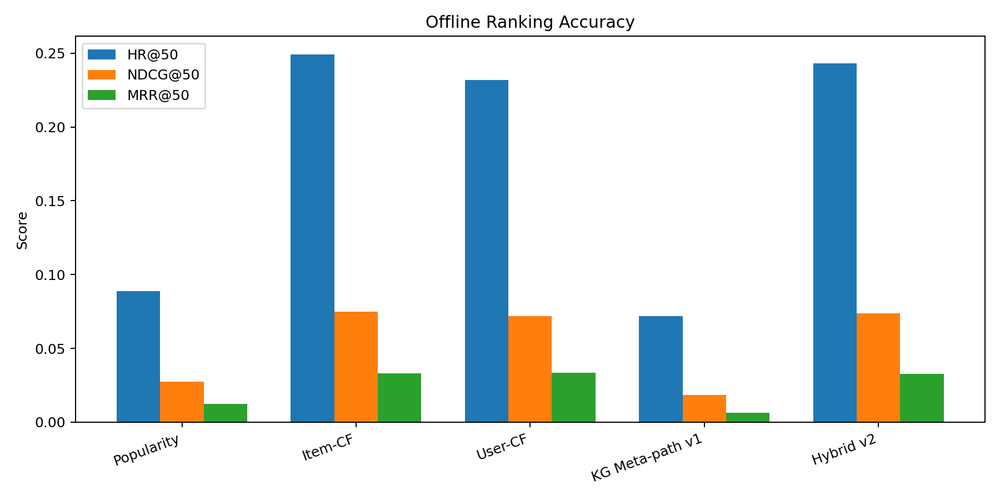
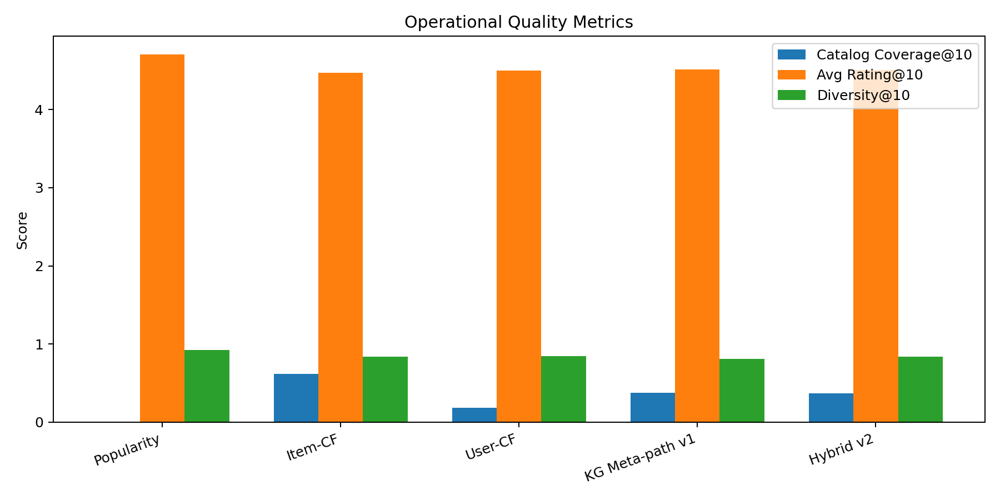
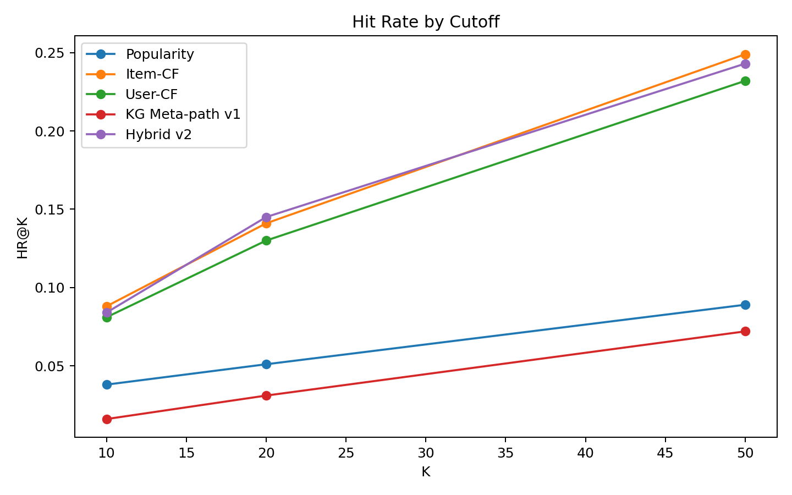

# 推荐算法横向对比与进化报告

## 1. 实验目的

本次实验不是为了证明“我们的算法一定最好”，而是为了客观判断当前推荐算法在不同指标下的表现，并根据结果决定是否需要修改算法。

当前系统的主算法是 KG 元路径推荐：  
`User -> RATED/VIEWED Product -> HAS_ATTRIBUTE -> Candidate Product`

这个设计的优势是解释性强，可以把推荐理由还原成图路径和属性证据。但它是否适合精确预测用户未来会再次交互的同一个 ASIN，需要通过横向实验验证。

## 2. 数据与评估设置

- 数据集：当前 Video_Games 知识图谱
- 商品数：1,728
- 评估用户数：1,000
- 用户行为数据：`RATED` 为主要离线行为信号，`VIEWED` 当前较少，主要作为在线增量信号
- 留出方式：每个用户最新一条 4 星及以上评分作为“未来目标商品”
- 评价任务：给定用户历史，预测该未来目标商品是否进入 Top-K 推荐列表

使用指标：

- HR@K：目标商品是否出现在 Top-K
- NDCG@K：目标商品越靠前得分越高
- MRR@K：第一个命中位置的倒数，强调排名靠前
- Coverage@10：推荐结果覆盖了多少不同商品
- Avg Rating@10：推荐商品平均评分
- Diversity@10：推荐列表内部属性差异度

## 3. 对比方法

| 方法 | 含义 |
|---|---|
| popularity | 全局热门/高评分商品 |
| item_cf | Item-based Collaborative Filtering |
| user_cf | 基于相似用户重叠行为的协同过滤 |
| kg_meta_path_v1 | 当前纯 KG 属性元路径 |
| hybrid_v2 | 协同过滤 + KG 元路径 + 热门度的离线融合版本 |

## 4. 第一轮发现

第一轮小样本实验显示，纯 KG 元路径的 exact-ASIN 预测效果明显弱于协同过滤。原因并不是 KG 没有价值，而是两类方法优化目标不同：

- KG 元路径更擅长解释“为什么相似”，例如共享平台、玩法、多人模式、目标人群等属性。
- Item-CF/User-CF 更擅长预测“用户未来具体会点/评哪个 ASIN”，因为它直接利用了共同交互行为。

因此，继续只加强属性元路径并不能解决主要问题。更合理的修改是：保留 KG 的解释性，同时把协同行为路径加入线上排序。

## 5. 已实施的算法修改

线上推荐器已从单一属性元路径升级为混合图路径排序：

```text
路径 A：User -> RATED/VIEWED Product -> HAS_ATTRIBUTE -> Candidate Product
路径 B：User -> RATED Product <- RATED Peer User -> RATED Candidate Product
```

也就是说，新的线上推荐同时考虑：

- 用户过去高评分商品共享的属性
- 最近浏览商品共享的属性
- 相似兴趣用户也高评分的候选商品
- 对话中抽取出的商品/类别/属性条件
- 商品评分与评论数量

推荐理由也随之升级：如果候选商品主要来自协同路径，前端会显示类似“好みが近いユーザにも高評価されている候補です / Highly rated by users with overlapping taste”的解释。

## 6. 第二轮横向结果







| 方法 | HR@50 | NDCG@50 | MRR@50 | Coverage@10 | Diversity@10 |
|---|---:|---:|---:|---:|---:|
| popularity | 0.0890 | 0.0274 | 0.0124 | 0.0081 | 0.9219 |
| item_cf | 0.2490 | 0.0750 | 0.0332 | 0.6209 | 0.8354 |
| user_cf | 0.2320 | 0.0719 | 0.0334 | 0.1823 | 0.8446 |
| kg_meta_path_v1 | 0.0720 | 0.0186 | 0.0064 | 0.3762 | 0.8102 |
| hybrid_v2 | 0.2430 | 0.0737 | 0.0327 | 0.3715 | 0.8361 |

## 7. 客观判断

按 NDCG@50 和 HR@50 看，当前最强的 exact-ASIN 预测方法仍是 `item_cf`。这说明如果目标是“尽可能预测用户未来会评价的同一个商品”，协同过滤信号非常关键。

`kg_meta_path_v1` 单独使用时表现不理想：HR@50 只有 0.0720，低于 popularity 的 0.0890。这说明当前 KG 属性虽然能提供解释，但作为唯一召回/排序依据会损失精确命中能力。

`hybrid_v2` 明显优于单一 KG 元路径，并接近 Item-CF：HR@50 为 0.2430，NDCG@50 为 0.0737。这说明“KG + 协同行为”是比“单独 KG”更合理的系统方向。

## 8. 结论

本轮实验支持以下结论：

1. 当前纯 KG 元路径不是最优秀的 exact-ASIN 预测算法。
2. 协同过滤是当前数据里最强的行为预测信号。
3. KG 的主要价值在于解释性、语义约束和对话条件过滤，而不是单独承担全部排序。
4. 最合理的系统形态是混合推荐：协同行为负责命中率，KG 负责解释和语义对齐。

## 9. 下一步建议

- 将离线 `item_cf` 的思想进一步线上化，例如预计算 item-item 相似度表或写入 Neo4j。
- 对 hybrid 权重做验证集调参，而不是手工设定。
- 增加真实 `VIEWED`/点击/收藏行为，让在线行为信号不再只依赖 `RATED`。
- 引入 `Review -> MENTIONS -> Attribute` 路径，用评论验证属性来提升推荐理由可信度。
- 评估指标继续分开看：exact-ASIN 命中、解释覆盖、多样性、用户可理解性，不用单一指标概括系统价值。

## 10. 产物位置

- 中间用户级结果：`per_user_results.jsonl`
- 汇总指标：`summary.json`
- 数据完整性检查：`preflight.json`
- 图表：`accuracy_metrics.png`、`quality_metrics.png`、`hr_by_cutoff.png`
