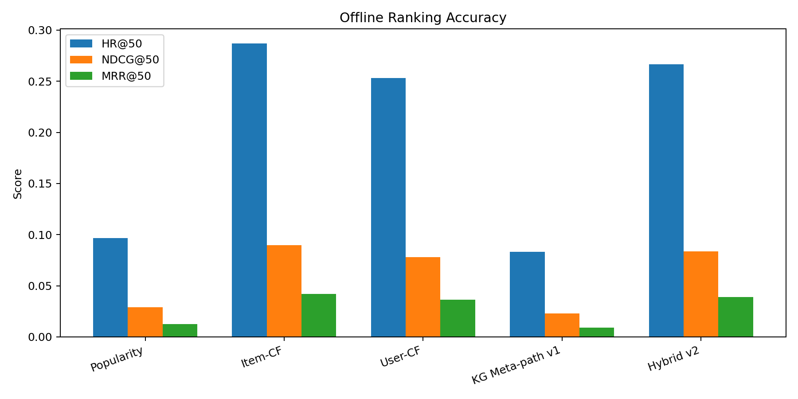
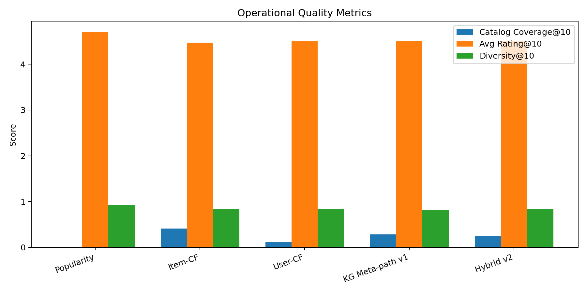
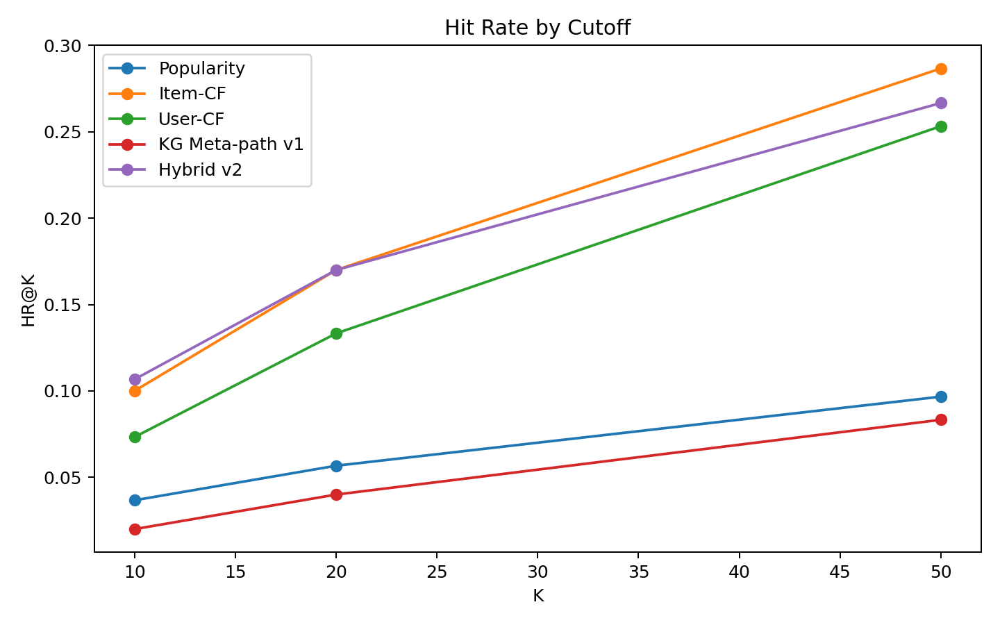

# 推荐算法横向对比与进化报告

## 实验设置

- 评估用户数：300
- 商品数：1728
- 留出方式：每个用户最新一条 4 星及以上评分作为未来目标商品。
- 指标：HR@K、NDCG@K、MRR@K、Catalog Coverage@10、Avg Rating@10、Diversity@10。
- 本轮说明：第一轮：比较当前 KG 元路径与协同过滤/热门基线，判断是否需要引入行为协同信号。

## 横向结果

| 方法 | HR@50 | NDCG@50 | MRR@50 | Coverage@10 | Diversity@10 |
|---|---:|---:|---:|---:|---:|
| popularity | 0.0967 | 0.0290 | 0.0125 | 0.0069 | 0.9214 |
| item_cf | 0.2867 | 0.0897 | 0.0420 | 0.4097 | 0.8291 |
| user_cf | 0.2533 | 0.0779 | 0.0364 | 0.1198 | 0.8417 |
| kg_meta_path_v1 | 0.0833 | 0.0229 | 0.0090 | 0.2853 | 0.8108 |
| hybrid_v2 | 0.2667 | 0.0838 | 0.0389 | 0.2454 | 0.8358 |

## 客观判断

- 当前最优方法按 NDCG@50 判断为：`item_cf`。
- 如果 `kg_meta_path_v1` 低于 Item-CF/User-CF，这是合理现象：KG 属性路径更擅长解释和语义泛化，不一定擅长精确预测未来同一个 ASIN。
- 如果 `hybrid_v2` 高于单一 KG 方法，说明应把协同行为信号纳入线上排序，而不是只依赖属性元路径。

## 结论与改进方向

- 保留 KG 元路径作为解释层和语义召回层。
- 引入 Item-CF/User-CF 作为行为协同排序信号，提高 exact-ASIN 离线预测能力。
- 继续增加 VIEWED/点击数据后，可重新评估在线行为对排序的贡献。
