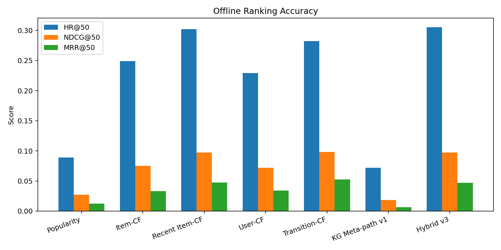
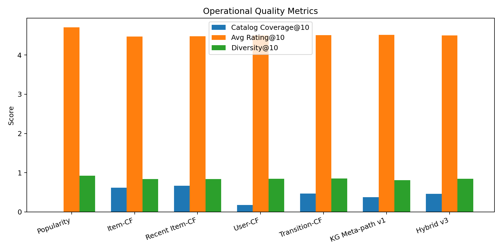
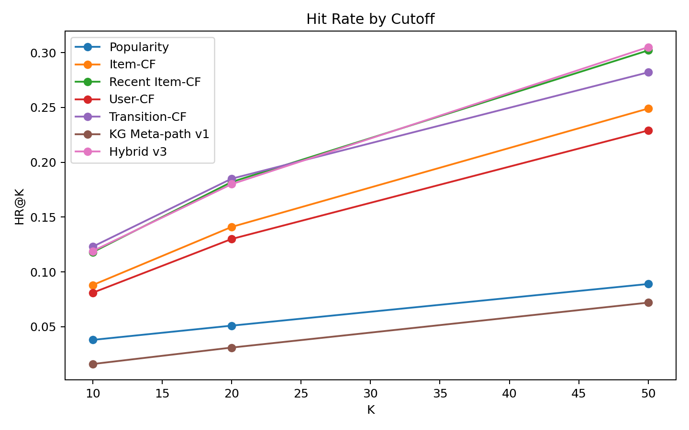

# 推荐算法横向对比与进化报告

## 实验设置

- 评估用户数：1000
- 商品数：1728
- 留出方式：每个用户最新一条 4 星及以上评分作为未来目标商品。
- 指标：HR@K、NDCG@K、MRR@K、Catalog Coverage@10、Avg Rating@10、Diversity@10。
- 本轮说明：第三轮迭代：在第二轮诊断基础上加入 Recent Item-CF、Transition-CF 和 Hybrid v3，用 1000 名用户验证近期兴趣与序列转移信号是否稳定改善推荐相关性。

## 横向结果

| 方法 | HR@50 | NDCG@50 | MRR@50 | Coverage@10 | Diversity@10 |
|---|---:|---:|---:|---:|---:|
| popularity | 0.0890 | 0.0274 | 0.0124 | 0.0081 | 0.9219 |
| item_cf | 0.2490 | 0.0750 | 0.0332 | 0.6209 | 0.8354 |
| item_cf_recent | 0.3020 | 0.0973 | 0.0477 | 0.6701 | 0.8400 |
| user_cf | 0.2290 | 0.0719 | 0.0340 | 0.1753 | 0.8449 |
| transition_cf | 0.2820 | 0.0980 | 0.0527 | 0.4688 | 0.8524 |
| kg_meta_path_v1 | 0.0720 | 0.0186 | 0.0064 | 0.3762 | 0.8102 |
| hybrid_v3 | 0.3050 | 0.0975 | 0.0468 | 0.4583 | 0.8429 |

## 客观判断

- 当前最优方法按 NDCG@50 判断为：`transition_cf`。
- 如果 `kg_meta_path_v1` 低于 Item-CF/User-CF，这是合理现象：KG 属性路径更擅长解释和语义泛化，不一定擅长精确预测未来同一个 ASIN。
- 如果 `hybrid_v2` 高于单一 KG 方法，说明应把协同行为信号纳入线上排序，而不是只依赖属性元路径。

## 结论与改进方向

- 保留 KG 元路径作为解释层和语义召回层。
- 引入 Item-CF/User-CF 作为行为协同排序信号，提高 exact-ASIN 离线预测能力。
- 继续增加 VIEWED/点击数据后，可重新评估在线行为对排序的贡献。
