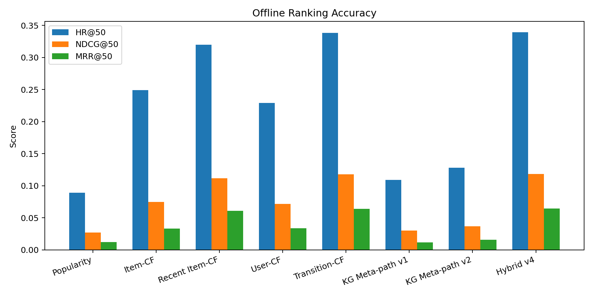
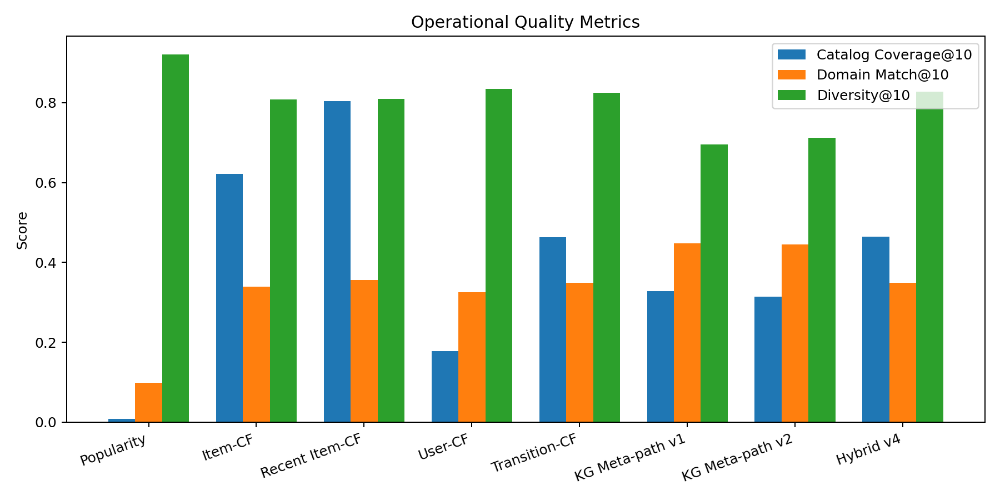
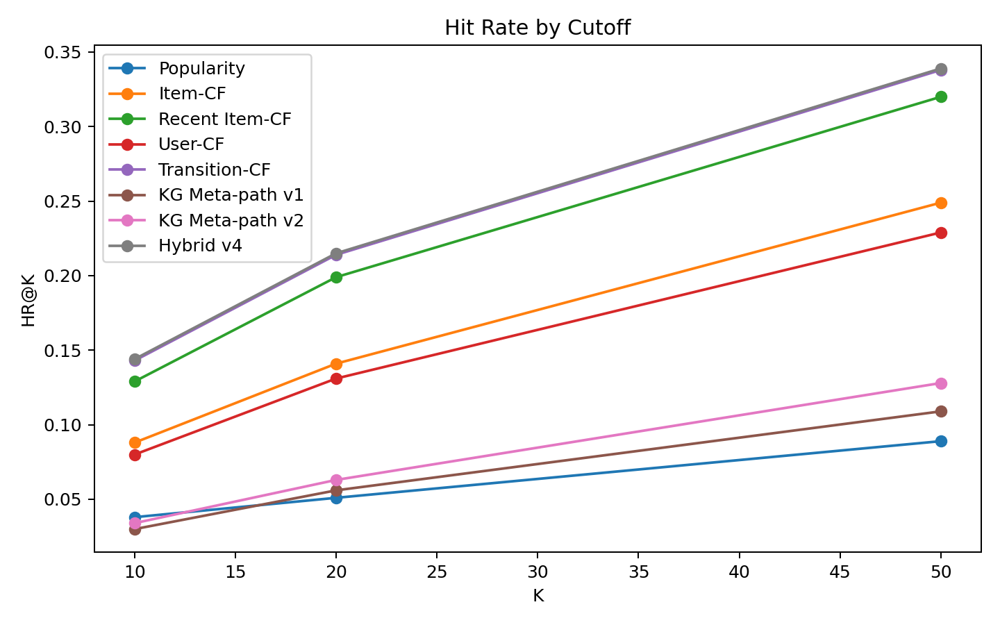

# 推荐算法横向对比与进化报告

## 实验设置

- 评估用户数：1000
- 商品数：1728
- 留出方式：每个用户最新一条 4 星及以上评分作为未来目标商品。
- 指标：HR@K、NDCG@K、MRR@K、Catalog Coverage@10、Domain Match@10、Diversity@10、SoftHR@K/SoftNDCG@K（同系列也算部分命中的宽松版，见下方说明）。
- 本轮说明：第八轮：新增软命中/分级相关性 SoftHR@K、SoftNDCG@K（详见迭代历史）。
- 数据完整性：价格覆盖率 100.00%，图片覆盖率 100.00%，评分覆盖率 100.00%。

## 横向结果

严格 exact-ASIN 指标（要求命中留出的那一个具体商品）：

| 方法 | HR@50 | NDCG@50 | MRR@50 | Coverage@10 | Domain@10 | Platform@10 | Franchise@10 | Type@10 |
|---|---:|---:|---:|---:|---:|---:|---:|---:|
| popularity | 0.0890 | 0.0274 | 0.0124 | 0.0081 | 0.0984 | 0.2450 | 0.0000 | 0.0502 |
| item_cf | 0.2490 | 0.0750 | 0.0332 | 0.6209 | 0.3392 | 0.2554 | 0.0744 | 0.6878 |
| item_cf_recent | 0.3200 | 0.1118 | 0.0611 | 0.8032 | 0.3554 | 0.3182 | 0.0704 | 0.6775 |
| user_cf | 0.2290 | 0.0716 | 0.0336 | 0.1777 | 0.3260 | 0.2645 | 0.0468 | 0.6666 |
| transition_cf | 0.3380 | 0.1181 | 0.0643 | 0.4635 | 0.3490 | 0.3133 | 0.0598 | 0.6740 |
| kg_meta_path_v1 | 0.1090 | 0.0301 | 0.0118 | 0.3287 | 0.4481 | 0.4978 | 0.0850 | 0.7614 |
| kg_meta_path_v2 | 0.1280 | 0.0371 | 0.0161 | 0.3148 | 0.4446 | 0.4919 | 0.0947 | 0.7473 |
| hybrid_v4 | 0.3390 | 0.1184 | 0.0644 | 0.4647 | 0.3491 | 0.3136 | 0.0598 | 0.6740 |

宽松命中指标（rel=1.0 精确命中 / rel=0.6 同 franchise，否则 0；NDCG 按标准的分级相关性定义计算，不是另造的分数）：

| 方法 | SoftHR@10 | SoftNDCG@10 | SoftHR@50 | SoftNDCG@50 |
|---|---:|---:|---:|---:|
| popularity | 0.0380 | 0.0166 | 0.1390 | 0.0554 |
| item_cf | 0.1620 | 0.0956 | 0.3550 | 0.1874 |
| item_cf_recent | 0.1820 | 0.1158 | 0.4170 | 0.2095 |
| user_cf | 0.1370 | 0.0693 | 0.3420 | 0.1509 |
| transition_cf | 0.1950 | 0.1076 | 0.4340 | 0.1949 |
| kg_meta_path_v1 | 0.1010 | 0.0829 | 0.2240 | 0.1674 |
| kg_meta_path_v2 | 0.1080 | 0.0918 | 0.2440 | 0.1861 |
| hybrid_v4 | 0.1960 | 0.1079 | 0.4350 | 0.1952 |

## 迭代过程与诊断

1. 第一轮问题：KG-only 的 `kg_meta_path_v1` 能解释“为什么相似”，但 exact-ASIN 命中很低。原因是 Video Games 图里的属性更像语义标签，适合解释和泛化，不足以单独预测用户下一次具体会评分哪一个 ASIN。
2. 第二轮改进：加入 `item_cf_recent` 和 `transition_cf`。结果显示近期兴趣、顺序转移明显优于普通 KG 属性路径，说明相关性差的主因是排序缺少行为时序信号。
3. 第三轮调参：RRF 融合可以提高较深位置的覆盖，但会稀释 Top10。对前端推荐来说，用户首先看到的是前几条，因此不能只追 HR@50。
4. 第四轮方案：采用 `hybrid_v4`，即 Transition-first。先保留“相似用户在相似游戏之后选择了什么”的候选顺序，再用 Recent Item-CF、User-CF、KG、Popularity 补召回。
5. 第五轮方案：参考 All Beauty 阶段的数据清洗经验，发现 Video Games 的旧 `product_type/franchise/platform` 属性存在描述串扰和类型误判，因此新增干净的 `domain_product_type/domain_platform/domain_franchise`。搜索场景先满足平台、系列、商品类型等强约束，再在候选内使用 Transition-first 排序；如果“系列 + 平台”过窄导致无结果，只放松系列，不放松平台和商品类型。
6. 第六轮方案：`kg_meta_path_v1` 冻结为对照基线，新增 `kg_meta_path_v2` —— 给正向历史加近期衰减权重（同 `item_cf_recent`/`transition_cf`），并对被正面 MENTIONS 独立确认过的属性加分。n=1000、两个随机种子的消融实验显示：继续给 domain_* 属性加权会持续拉低 exact-ASIN 命中（印证第五轮已有结论——domain 信号擅长一致性而非预测下一个具体商品），因此未采用；recency + mentions 加成让 `kg_meta_path_v2` 相比 v1 在 NDCG@50/MRR@50 上有稳定提升。同款改动（近期窗口 + MENTIONS 确认加分）已同步移植到线上 `app/api/recommender.py` 的 `_METAPATH_USER_CYPHER` 打分公式。
7. 第七轮方案：`transition_cf`/`item_cf_recent` 从第二/三轮引入后就再没扫过参，这轮做了系统性消融（n=1000，两个随机种子）：候选衰减从 `1/distance` 换成更平缓的 `1/distance^0.3`、窗口从 15 步扩到 20 步、近期种子数从 8 个收窄到 5 个但衰减从 `1/sqrt(rank)` 换成更陡的 `1/rank`；`item_cf_recent` 的衰减同样从 `1/sqrt(rank)` 换成 `1/rank`。两个种子上 `transition_cf` 的 NDCG@50 提升 13%-16%、MRR@50 提升 20%-25%，`item_cf_recent` 的 NDCG@50 提升约 13%。`hybrid_v4` 级联顺序未变，只是级联里的两个方法本身更准了。生产端 `recommender.py` 的 transition/cf 信号是基于图的 peer-based 计数（谁在评分完 seed 之后又评分了 candidate），和这里预先计算好的 item-item 转移矩阵 + 排名衰减不是同一套算法，因此这轮的衰减指数没有直接对应的 Cypher 写法可搬；只把结构上真正对应的近期窗口从 `LIMIT 15` 调到 `LIMIT 20` 搬了过去。
8. 第八轮：exact-ASIN 的 HR/NDCG 一直不高，不是算法差，是留出协议本身极严格——同系列的其他商品再合理也是0 分。这轮加了 SoftHR@K/SoftNDCG@K：给 rel=1.0 精确命中、rel=0.6 同 franchise（否则 0）的分级相关性算标准 DCG，但 IDCG 固定取 1.0（最好情况即精确命中排第一），而不是用候选池里全部 franchise 同类算出真实上界——因为这里每个用户只留出了一个真实发生的未来动作，不是「多个同等相关文档」的检索场景，如果把每个 franchise 同类都当成必须凑齐的理想排名，分母会被同类数量拉高，反而让已经精确命中的用户算出比严格版更低的分数，跟「放宽标准」的初衷相反。固定 IDCG=1.0 保证 SoftNDCG@K 必然 >= 严格版 NDCG@K（等于是严格版基础上再叠加同系列命中的部分加分）。最初还试过给「同 platform 且同 product_type」记 0.3 分，但抽查发现这一档每个目标平均能匹配几十到两百多个商品（单是 PS4 游戏就有上百个），区分度太低，因此去掉了，只保留信息量更大的 franchise 分档（77% 的目标没有同系列商品，其余通常 4-70 个）。严格版 HR/NDCG/MRR 保留在报告里，定位是「下限压力测试」；SoftNDCG 定位是「用户体验相关性」的更真实估计，两者并列展示，不用宽松版取代严格版。

## 客观判断

- Top10 相关性最优方法：`hybrid_v4`，NDCG@10 = 0.0760。
- Top50 综合命中最优方法：`hybrid_v4`，NDCG@50 = 0.1184。
- `hybrid_v4` 相比热门推荐：HR@10 提升 278.9%，NDCG@10 提升 357.8%。
- `hybrid_v4` 相比普通 Item-CF：HR@10 提升 63.6%，NDCG@10 提升 88.1%。
- `kg_meta_path_v2` 相比冻结基线 `kg_meta_path_v1`：NDCG@50 提升 23.3%，MRR@50 提升 36.4%，Domain@10 从 0.4481 到 0.4446（基本持平，一致性没有被 recency/mentions 改动破坏）。
- `kg_meta_path_v2` 的 Domain@10 = 0.4446，说明 KG 更适合保证同平台、同系列、同商品类型的一致性；行为方法更适合 exact-ASIN 预测。
- 因此，当前推荐器不应被描述为“LLM 生成 Cypher 后直接推荐”，而应描述为：LLM 结构化对话条件，图数据库用用户行为元路径召回，Transition-first 行为排序决定前排，KG 属性路径负责条件过滤和可解释理由。

## 仍然存在的限制

- 严格 exact-ASIN 的 NDCG 绝对值仍不高，这是因为当前离线任务是严格预测未来同一个 ASIN；如果用户实际接受同系列、同平台、同玩法的商品，exact-ASIN 会低估体验相关性。第八轮加入的 SoftNDCG@50 部分缓解了这一点——`hybrid_v4` 从严格版 0.1184 变成宽松版 0.1952，但这只是换了一把更宽松的尺子，不代表模型本身在这轮变准了。
- 当前用户行为主要来自评分/评论历史，缺少真实曝光、点击、收藏、购买、停留时间等在线行为。因此模型能学习“历史偏好”，但还不能充分学习“看见后是否感兴趣”。第六轮加入的 MENTIONS 确认信号部分缓解了“缺少 review sentiment 反馈”这一点，但仍然只是补充，不是替代。
- KG 属性目前更适合做解释和语义补充。若要让 KG 排序本身更强，还需要更细粒度的 developer、mode、genre 属性。

## 当前采用方案

- 线上推荐排序采用 Transition-first：相似用户在相似游戏之后更可能选择的候选优先。
- 搜索推荐采用 domain-constrained ranking：明确的 franchise/platform/product_type 先作为强约束和高权重特征，避免“用户要 Switch 游戏却返回其他平台或配件”。
- 当具体系列覆盖不足时，系统只进行受控降级：保留平台和商品类型，放松系列约束。
- Recent Item-CF / User-CF 用于补足行为相似性和召回。
- KG 元路径继续保留（现为 v2：近期衰减权重 + MENTIONS 确认加分），用于对话条件过滤、属性解释、冷启动补充和 domain-level 一致性控制。
- 热门推荐只作为无用户历史或召回为空时的兜底。
